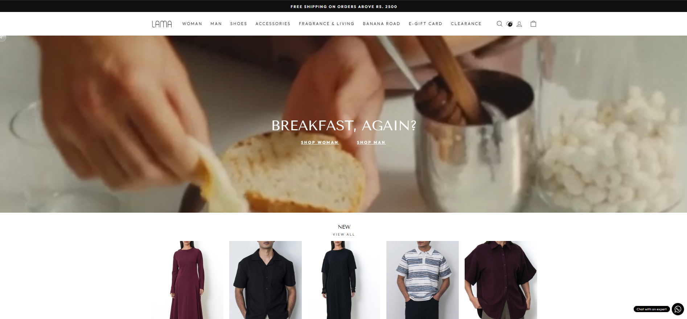
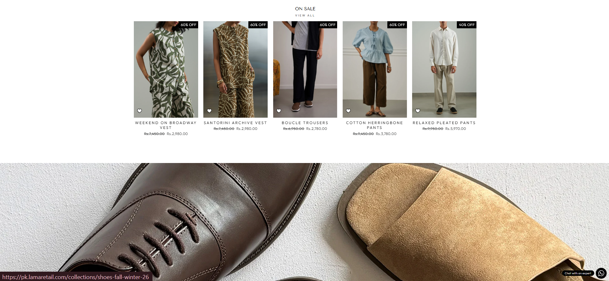
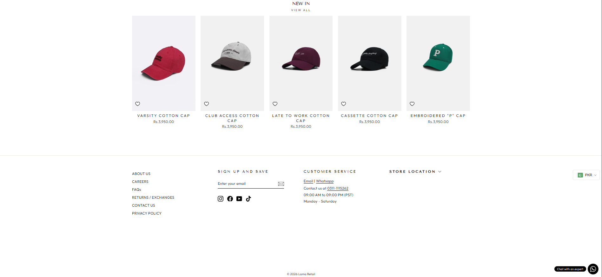
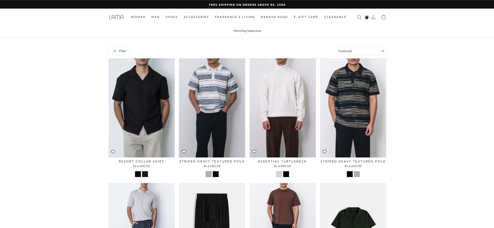
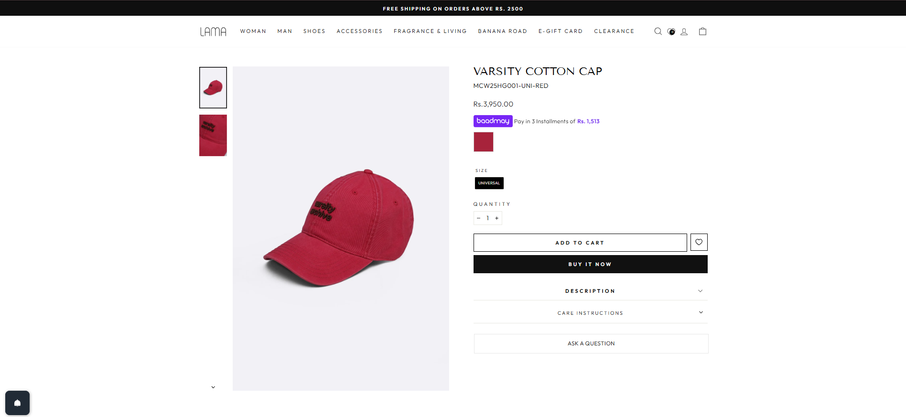
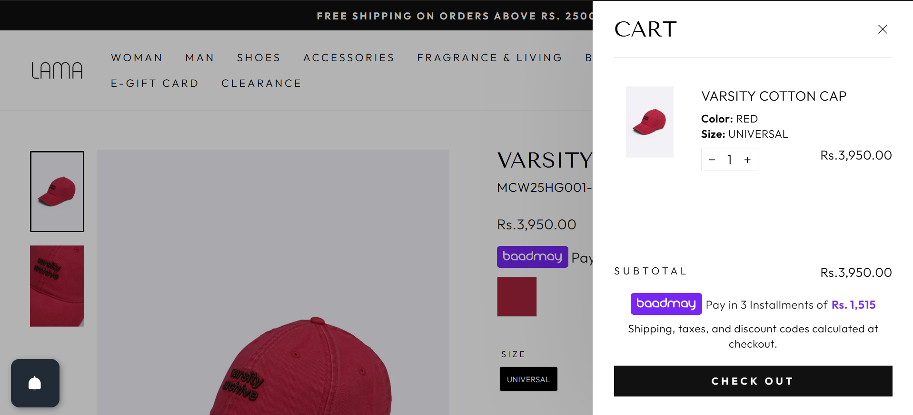
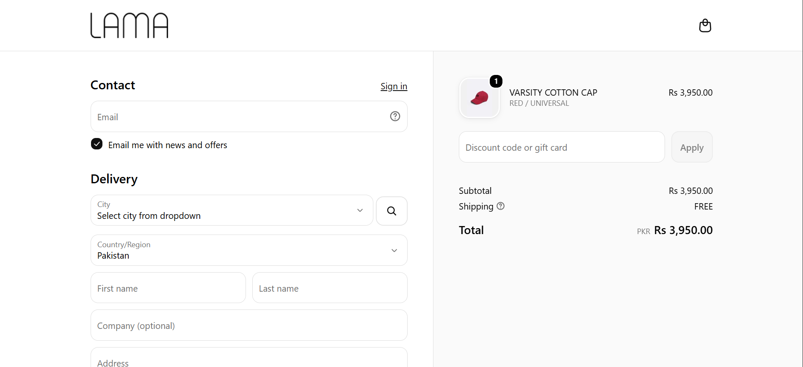
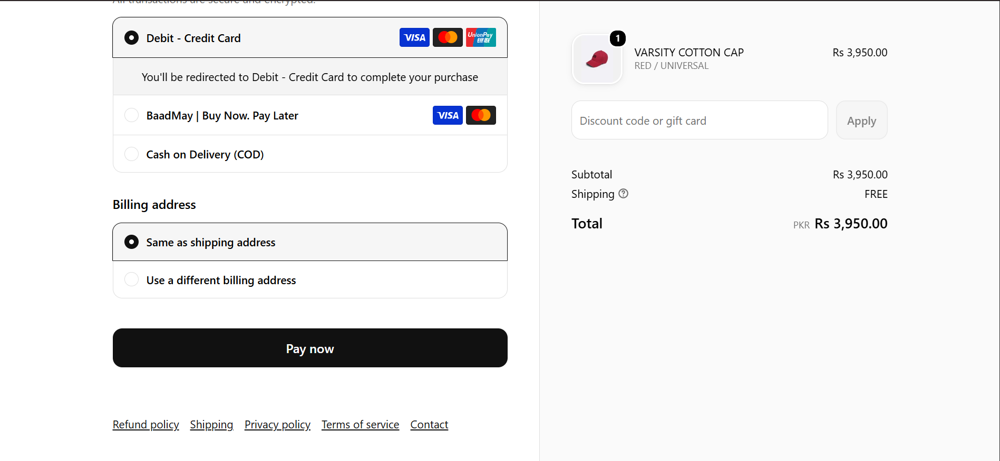

# Assignment 2: E-commerce Site (Static, Responsive Pages)

**Course:** CSC336 Web Technologies, Fall 2026
**Student:** Taha Nadeem
**Roll Number:** FA24-BCS-109

---

## Reference Site

- **Name:** Lama Retail
- **URL:** https://pk.lamaretail.com/

Lama Retail is a Pakistani fashion brand with a live online store. I am using it as a realistic model for a product listing page, a product detail page and, in later assignments, a cart and checkout flow. I am not copying its code or images.

### Homepage



### Other sections of the homepage

**On Sale section (product grid with sale prices and badges)**



**Product row and footer (columns, newsletter signup, customer service)**



### Other pages of the reference site (used as design references)

**Product listing page** (filter and sort bar, 4-column grid)



**Product detail page** (thumbnails, large image, size, quantity, Add to Cart)



**Cart** (used in Assignment 3)



**Checkout** (used in Assignment 4)





---

## About This Project

A static, responsive front page and product page for an e-commerce site, modeled on Lama Retail. This assignment covers layout, styling and responsiveness only. There is no JavaScript yet, so the cart icon and "Add to Cart" buttons do not work. They are added in Assignment 3.

## Pages

| File             | Description                                                                                                                      |
| ---------------- | -------------------------------------------------------------------------------------------------------------------------------- |
| `index.html`     | Homepage and product listing: header with logo, navbar and cart icon, a responsive grid of 8 or more product cards, and a footer |
| `product.html`   | Product detail page: larger image, name, price, description, quantity selector, "Add to Cart" button, and the same footer        |
| `css/styles.css` | My own styles layered on top of Bootstrap                                                                                        |

## Tech Used

- HTML5
- CSS3 (custom styles in `css/styles.css`)
- **Bootstrap 5**, loaded from a CDN, used for:
  - the responsive navbar (collapses into a menu button on small screens)
  - the grid system (`row` and `col-*` classes) for the product cards and footer columns
- No JavaScript written by me. Bootstrap's own script is used only for the navbar toggle.

## Responsive Design

The layout reflows at three widths:

| Width                      | Layout                                                                                  |
| -------------------------- | --------------------------------------------------------------------------------------- |
| Phone (~375px)             | Product cards in 2 columns, navbar collapsed into a menu button, footer columns stacked |
| Tablet (~768px)            | Product cards in 3 columns, footer in 2 columns                                         |
| Desktop (1200px and above) | Product cards in 4 columns, full navbar, footer in 4 columns                            |

## Folder Structure

```
assignment-2/
├── index.html
├── product.html
├── README.md
├── css/
│   └── styles.css
├── images/
├── screenshots/
│   ├── reference-homepage.png
│   ├── reference-sale.png
│   ├── reference-footer.png
│   ├── desktop.png
│   ├── tablet.png
│   ├── phone.png
│   └── reference/
│       ├── listing-page.png
│       ├── product-page.png
│       ├── cart-drawer.png
│       ├── checkout-top.png
│       └── checkout-payment.png
└── Assignment2_TahaNadeem_FA24-BCS-109.pdf
```

## How to Run

1. Clone the repository and open the `assignment-2` folder in VS Code.
2. Right-click `index.html` and choose **Open with Live Server**, or just open the file in a browser.
3. Click a product (or open `product.html`) to see the detail page.

## Notes

- Product names, prices and images are placeholders modeled on the style of the reference site.
- The same reference site is used in Assignments 3 and 4.
